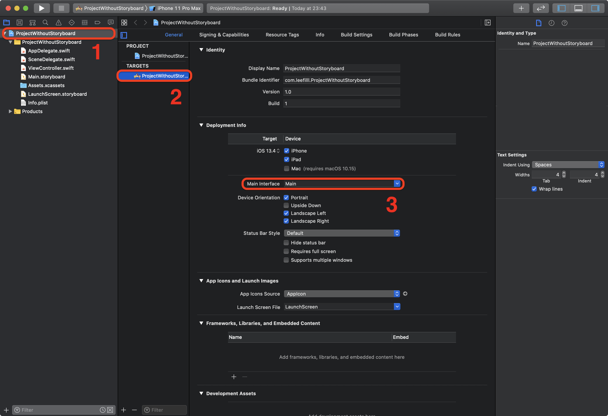
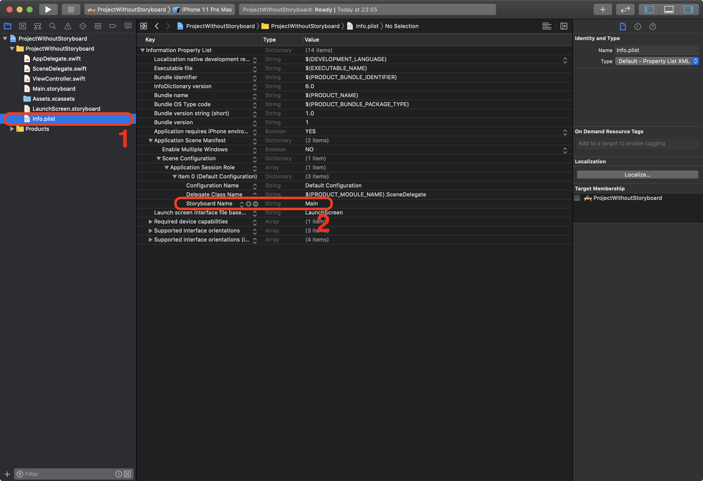

# RxFlow With SwiftUI (List To Detail)

 

## About 

RxFlow + SwiftUI Very Simple Example 
 
[List View] -> [Detail View]

* Navigation System : UIKit + RxFlow
* UI : SwiftUI (instead of storyboard)

 

## Preview

 

## Project Setup

* Remove 'Main Interface' field (Screenshot #3)

* Delete Setup 
* Remove Storyboard Name (Screenshot #2)

* Add RxFlow Framework (ref below site)
 
RxFlow: https://github.com/RxSwiftCommunity/RxFlow

 

## Reference

[Swift] Xcode에서 Storyboard 없이 iOS 개발하기
 
https://leefilll.github.io/2020-04-06/xcode_without-storyboard

Use SwiftUI in UIKit View Controllers with UIHostingController
 
https://medium.com/@max.codes/use-swiftui-in-uikit-view-controllers-with-uihostingcontroller-8fe68dfc523b

Programmatic routing in SwiftUI 
 
https://pyartez.github.io/swiftui/programmatic-routing-swiftui.html

Chapter 11: Working with Navigation UI and Navigation Bar Customization
 
https://www.appcoda.com/learnswiftui/swiftui-navigation.html

ViewBuilder and ViewModifier: Base Views and Reusable Components in SwiftUI
 
https://www.iosapptemplates.com/blog/swiftui/viewmodifier-viewbuilder
